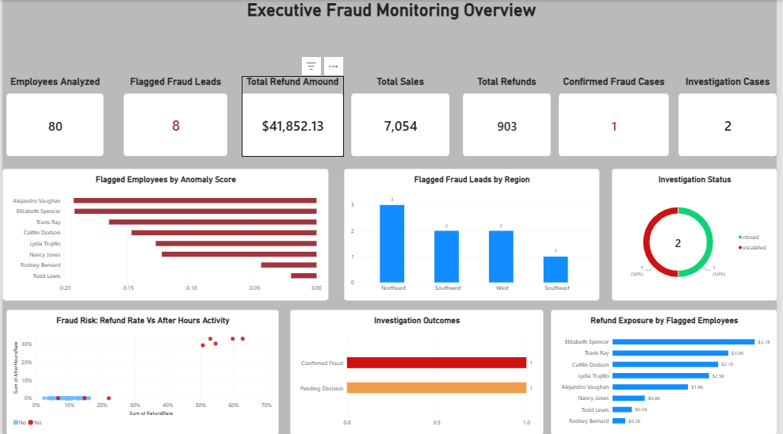
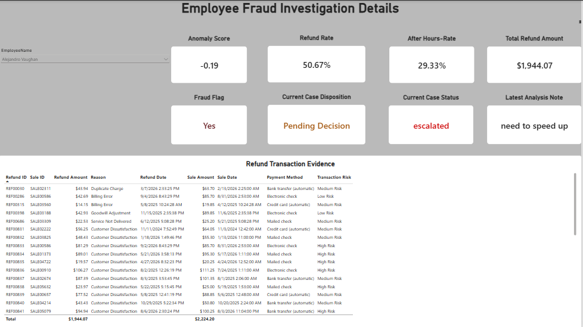

# 🛡️ Internal Sales Fraud Detection & Analytics Platform

[](https://www.python.org/)
[](https://flask.palletsprojects.com/)
[](https://scikit-learn.org/)
[](https://www.sqlite.org/)
[](LICENSE)

An end-to-end data analytics platform that identifies suspicious employee behavior in an insurance sales context — built to demonstrate SQL, Python, pandas, machine learning, and dashboarding skills through a realistic, portfolio-ready fraud investigation workflow.

---

## 📌 Project Overview

Insurance enterprises handle thousands of sales transactions, policy modifications, and customer refunds daily. Manual review processes cannot scale to cover every transaction, which means internal fraudulent activity — such as artificial refund abuse, duplicate customer accounts, or off-hours policy changes — often goes unnoticed until significant financial loss occurs.

This platform combines a real-world dataset (IBM Telco Customer Churn) with synthetically generated Employee, Sales, Calls, Refunds, and Commissions data, deliberately injects realistic fraud scenarios, and applies unsupervised machine learning (Isolation Forest) to flag high-risk employees — with results validated against a known ground truth.

---

## ⚙️ Key Features

- **Data Warehouse Layer** — integrates Employees, Customers, Sales, Calls, Refunds, Commissions, and Fraud Ground Truth into an indexed SQLite database.

- **Synthetic Fraud Scenario Injection** — deliberately introduces realistic fraud behaviors, including abnormal refund activity, after-hours sales, and duplicate customer activity for controlled model validation.

- **SQL-Based Feature Engineering** — calculates employee-level behavioral indicators such as refund rate, after-hours transaction rate, sales volume, refund amount, and other fraud-risk features.

- **Unsupervised Anomaly Detection** — uses scikit-learn Isolation Forest to identify employees whose transaction behavior deviates significantly from normal patterns.

- **Ground-Truth Model Validation** — evaluates detected anomalies against deliberately planted fraud cases using precision, recall, and F1 score.

- **Interactive Flask Fraud Dashboard** — provides fraud KPIs, employee risk rankings, search and filtering, risk indicators, and investigation drill-down capabilities.

- **Transaction-Level Evidence Review** — allows investigators to examine sales, refunds, refund reasons, payment methods, after-hours activity, and transaction-level risk classifications for flagged employees.

- **Investigation Case Management** — supports case status, investigation disposition, analyst notes, escalation, case closure, and historical investigation records stored in SQLite.

- **Power BI Executive Fraud Monitoring** — provides executive-level KPIs and visual analysis of anomaly scores, refund exposure, regional fraud leads, investigation outcomes, and behavioral risk patterns.

- **Power BI Investigation Details** — enables employee-level investigation analysis with risk metrics, current case status, disposition, analyst notes, and detailed refund transaction evidence.


---

## 🏗️ System Architecture & Workflow

```
┌─────────────────────────────────────────────┐
│ 1. DATA GENERATION                          │
│                                             │
│ • IBM Telco Customer Churn customer data    │
│ • Synthetic employee, sales, calls,         │
│   refunds, and commissions data             │
│ • Deliberate fraud scenario injection       │
└──────────────────────┬──────────────────────┘
                       │
                       ▼
┌─────────────────────────────────────────────┐
│ 2. DATA WAREHOUSE                           │
│                                             │
│ • SQLite database (fraud_analytics.db)       │
│ • Employees, Customers, Sales, Calls,       │
│   Refunds, Commissions & Ground Truth       │
│ • Indexed relational joins                  │
└──────────────────────┬──────────────────────┘
                       │
                       ▼
┌─────────────────────────────────────────────┐
│ 3. ANALYTICS & FEATURE ENGINEERING          │
│                                             │
│ • SQL aggregation                           │
│ • Refund rate                               │
│ • After-hours activity                      │
│ • Sales/refund volume                       │
│ • Employee-level behavioral features        │
└──────────────────────┬──────────────────────┘
                       │
                       ▼
┌─────────────────────────────────────────────┐
│ 4. MACHINE LEARNING                         │
│                                             │
│ • Isolation Forest anomaly detection        │
│ • Employee anomaly scoring                  │
│ • Fraud lead identification                 │
│ • Ground-truth validation                   │
└──────────────────────┬──────────────────────┘
                       │
                       ▼
┌─────────────────────────────────────────────┐
│ 5. FRAUD INVESTIGATION WORKFLOW             │
│                                             │
│ • Employee risk prioritization              │
│ • Transaction-level evidence review         │
│ • Case status & disposition                 │
│ • Analyst notes & investigation history     │
└──────────────────────┬──────────────────────┘
                       │
                       ▼
┌─────────────────────────────────────────────┐
│ 6. REPORTING & DECISION SUPPORT             │
│                                             │
│ • Flask investigation dashboard             │
│ • Power BI executive fraud monitoring       │
│ • Power BI investigation details            │
│ • Fraud KPIs & investigation outcomes       │
└─────────────────────────────────────────────┘

```
---

## 📊 Model Results

The Isolation Forest model was validated against a known set of 5 deliberately planted fraudulent employees:

| Metric | Result |
|---|---|
| Recall | 100% (5/5 planted fraud cases caught) |
| Precision | 62.5% (5 true positives / 8 flagged) |
| F1 Score | 76.9% |

All 5 planted fraudulent employees ranked in the **top 5** highest anomaly scores out of 80 total employees. The 3 false positives are documented and analyzed as realistic borderline cases rather than tuned away — see `docs/project_charter.md` for discussion.

---

### Business Interpretation

The model achieved **100% recall**, identifying all 5 deliberately planted fraudulent employees. In a fraud-monitoring environment, high recall is especially important because missed fraud cases can result in financial loss, customer impact, and compliance risk.

The **62.5% precision** indicates that 5 of the 8 employees flagged by the model matched the planted fraud scenarios. The remaining 3 employees represent false positives that would require analyst investigation rather than being automatically classified as fraud.

The **76.9% F1 score** reflects the balance between detecting fraudulent behavior and limiting unnecessary investigations.

Rather than automatically determining guilt, the model functions as a **risk-prioritization tool**. It identifies unusual employee behavior and directs investigators toward cases requiring further review, while the final investigation decision remains with the analyst.

---

## 📊 Power BI Fraud Analytics Dashboard

The project includes a two-page Power BI solution designed for both executive fraud monitoring and detailed investigation analysis.

### Executive Fraud Monitoring Overview


The executive dashboard provides a high-level view of fraud exposure and investigation activity, including:

- Employees analyzed and flagged fraud leads
- Total sales, refunds, and refund exposure
- Confirmed fraud and active investigation cases
- Employee anomaly-score ranking
- Fraud leads by geographic region
- Investigation status and outcomes
- Refund exposure by flagged employee
- Refund rate vs. after-hours activity analysis

### Employee Fraud Investigation Details


The investigation dashboard allows analysts to select an employee and review:

- Anomaly score
- Refund rate
- After-hours transaction rate
- Total refund exposure
- Fraud flag
- Current case status
- Investigation disposition
- Latest analyst notes
- Transaction-level refund evidence
- High-, medium-, and low-risk transaction classifications

The Power BI model integrates employee, sales, refund, machine-learning, and investigation data to support both executive monitoring and analyst-level fraud investigation.


---
## 🛠️ Tech Stack & Dependencies

- **Language:** Python 3.9+
- **Data Generation:** `pandas`, `Faker`
- **Database:** SQLite
- **Machine Learning:** `scikit-learn` (Isolation Forest)
- **Data Visualization:** `matplotlib`, `seaborn`, Chart.js
- **Web Framework:** `Flask`
- **BI Tool:** Power BI
- **Version Control:** Git, GitHub
- **IDE:** Visual Studio Code (VS Code)

---

## 📁 Project Structure

```
Internal-Fraud-Analytics-Platform/
├── .github/             # CI/CD workflows and issue templates
├── data/                # Raw, processed, and generated datasets + SQLite DB
├── docs/                # Project charter, architecture diagrams
├── notebooks/           # Exploratory analysis and model prototyping
├── scripts/             # Data generation, fraud injection, SQL, ML pipeline
├── models/              # Saved trained model files
├── reports/             # Generated reports and exports
├── static/              # CSS and static assets for the Flask dashboard
├── templates/           # HTML templates for the Flask dashboard
├── tests/                # Unit and integration tests
├── app.py               # Flask application entry point
├── requirements.txt     # Python dependencies
├── LICENSE
└── README.md
```

---

## 🚀 Quickstart & Installation

### 1. Clone the Repository
```bash
git clone https://github.com/GucciFarmer313/Internal-Fraud-Analytics-Platform.git
cd Internal-Fraud-Analytics-Platform
```

### 2. Create and Activate a Virtual Environment
```bash
python -m venv venv
# Windows
venv\Scripts\activate
# macOS/Linux
source venv/bin/activate
```

### 3. Install Dependencies
```bash
pip install -r requirements.txt
```

### 4. Generate the Dataset and Run the Pipeline
```bash
python scripts/Generate_employees.py
python scripts/Generate_sales.py
python scripts/Generate_calls.py
python scripts/Generate_refunds.py
python scripts/Generate_commissions.py
python scripts/Inject_fraud_scenarios.py
python scripts/load_to_sqlite.py
python scripts/fraud_risk_score.py
python scripts/isolation_forest_model.py
```

### 5. Run the Dashboard
```bash
python app.py
```

The dashboard will be available at `http://localhost:5000`.

---

## 🧭 Project Status

- ✅ Phase 1: Project Planning — complete
- ✅ Data Warehouse Layer (SQLite) — complete
- ✅ Analytics Layer (SQL feature engineering) — complete
- ✅ Machine Learning Layer (Isolation Forest + ground-truth validation) — complete
- ✅ Flask Fraud Investigation Dashboard — complete
- ✅ Investigation Case Management Workflow — complete
- ✅ Transaction-Level Evidence Analysis — complete
- ✅ Power BI Executive Fraud Monitoring Dashboard — complete
- ✅ Power BI Employee Investigation Details Dashboard — complete

The platform now supports the complete fraud analytics workflow from data generation and storage through anomaly detection, investigation, case disposition, transaction-level evidence review, and executive BI reporting.

See `docs/project_charter.md` for the full project scope, objectives, architecture, and data-source details.

---

## 📄 License

This project is licensed under the MIT License — see the [LICENSE](LICENSE) file for details.